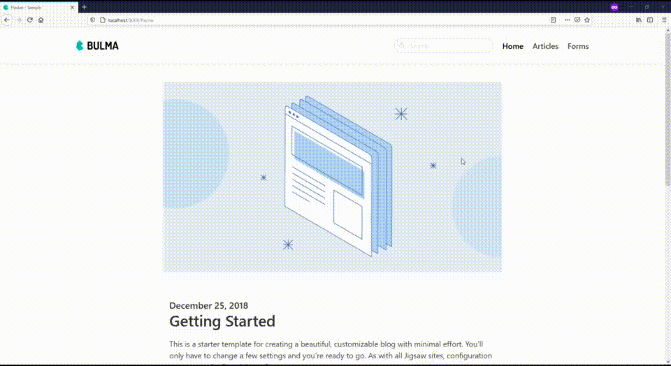

# Flasker - Definitely Minimal Flask Boilerplate

This is a Flask boilerplate good for starting a new project from scratch quickly. It is minimal enough that developers are given enough flexibility to develop the app right now without spending more time on understand how to start developing.

## Requirements
- Having experience on Flask
- Install dependencies from _requirements.txt_

## A Little Bit of Details
This boilerplate has complete set of what minimal web app should have: webpages, routes, forms, and models. It comes with a sample template so you can run _run.sh_ and check around first!

this will be final output

